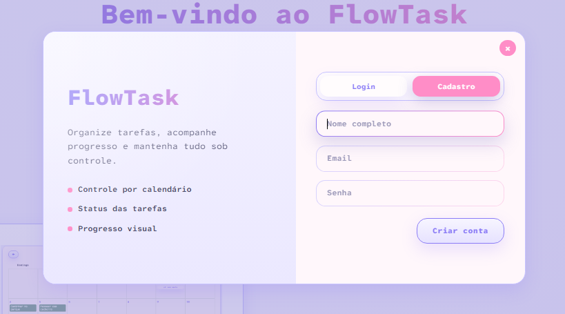
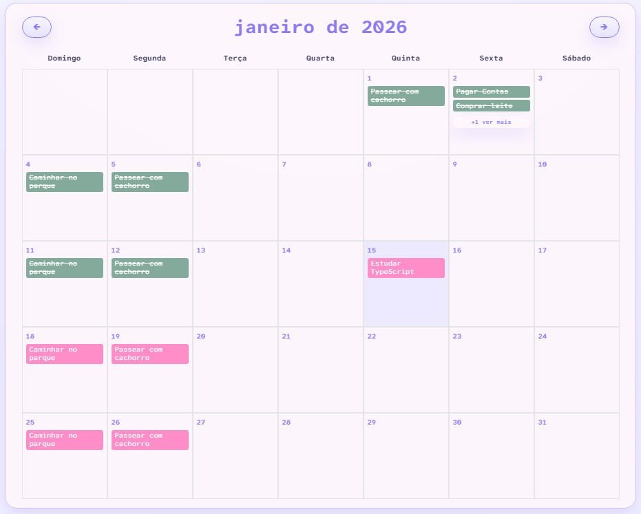
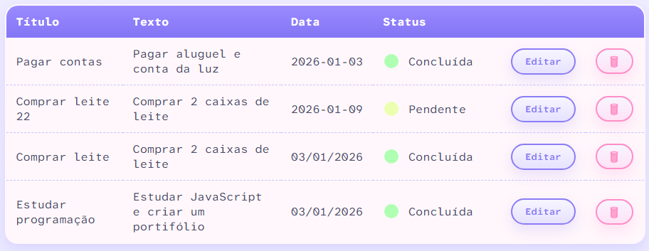

<h1>
  
  Flow Task
</h1>

Aplicação web de gerenciamento de tarefas desenvolvida com JavaScript puro (Vanilla JS), sem uso de frameworks ou bibliotecas externas.

---

## Funcionalidades

- Registro e login de usuário.
- Edição de informações do usuário.
- Criação, edição e exclusão de tarefas
- Listagem e organização das tarefas
- Interface simples e responsiva

---

## Tecnologias

- HTML5
- CSS3
- JavaScript (ES6+)

---

## Interface






---

## Como executar

1. Clone o repositório:

```bash
git clone https://github.com/rafasversion/task-manager-vanilla-js.git
```

2. Abra o arquivo index.html no navegador.

## Licença

Projeto de uso educacional.
